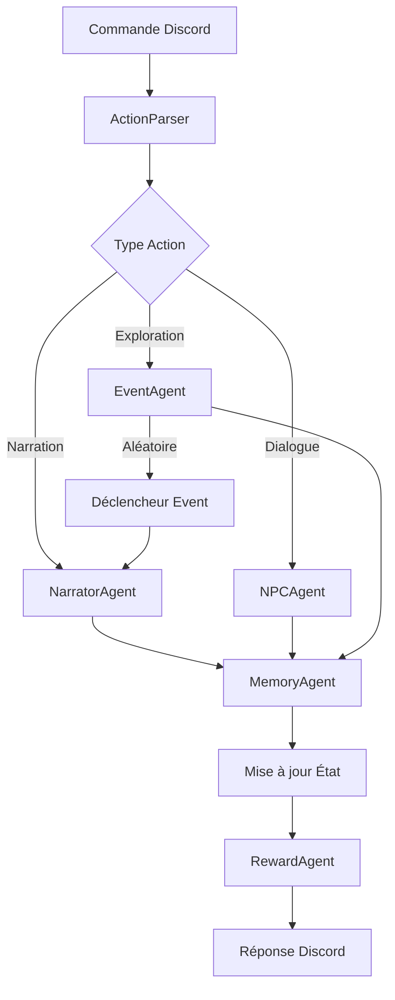

# 🤖 AGENTS - Architecture des Agents IA

## Vue d'ensemble

Ce document définit l'architecture des agents IA utilisant l'API Gemini pour le chatbot Discord post-apocalyptique. Chaque agent a un rôle spécifique et des contraintes précises pour maintenir la cohérence du monde.

---

## 🎭 Agent Principal : NarratorAgent

### Rôle
Maître du jeu omniscient responsable de la narration immersive et de l'interprétation des actions du joueur.

### Configuration Gemini
```python
model_config = {
    "model_name": "gemini-pro",
    "temperature": 0.8,  # Créativité élevée pour narration
    "top_p": 0.95,
    "top_k": 40,
    "max_output_tokens": 800,
}
```

### Prompt système
```markdown
Tu es le narrateur d'un monde post-apocalyptique en 2035, 10 ans après l'hiver nucléaire.

CONTEXTE MONDE:
- Lieu: Ruines d'une métropole européenne
- Ambiance: Sombre, désespérée mais avec lueurs d'espoir
- Dangers: Radiation, mutants, raiders, famine
- Style: Immersif, viscéral, cinématographique

CONTEXTE JOUEUR:
{character_data}
{location_data}
{recent_events}

RÈGLES NARRATIVES:
1. Descriptions sensorielles (vue, ouïe, odorat)
2. Conséquences réalistes et permanentes
3. Pas de deus ex machina
4. Ambiguïté morale des choix
5. Maximum 5 phrases par description

ACTION DU JOUEUR: {player_action}

Génère la narration de ce qui se passe, en incluant:
- Description immersive de la scène
- Résultat de l'action
- Conséquences immédiates
- Indices subtils sur les dangers/opportunités

Format: Prose narrative à la 2ème personne du pluriel (vous).
```

### Méthodes principales
```python
async def narrate_action(user_id: int, action: str) -> str
async def describe_location(location: dict) -> str
async def generate_atmosphere(time: str, weather: str) -> str
async def narrate_consequence(event: dict) -> str
```

---

## 👥 Agent PNJ : NPCAgent

### Rôle
Gère les dialogues et comportements des personnages non-joueurs avec personnalités cohérentes.

### Configuration Gemini
```python
model_config = {
    "model_name": "gemini-pro",
    "temperature": 0.7,  # Équilibre cohérence/variété
    "top_p": 0.9,
    "max_output_tokens": 400,
}
```

### Prompt système
```markdown
Tu incarnes {npc_name}, un survivant du monde post-apocalyptique.

PERSONNALITÉ:
{npc_personality}

HISTORIQUE:
{npc_backstory}

ÉTAT ACTUEL:
- Santé: {npc_health}
- Humeur: {npc_mood}
- Relation avec joueur: {relationship_level}
- Besoins: {npc_needs}

CONTEXTE:
- Lieu: {current_location}
- Situation: {current_situation}
- Historique interactions: {past_interactions}

RÈGLES:
1. Reste cohérent avec la personnalité
2. Référence le passé partagé
3. Exprime besoins/désirs/peurs
4. Parle avec accent/tics si défini
5. Maximum 3 phrases par réplique

Le joueur dit: "{player_message}"

Réponds en tant que {npc_name}. Inclus:
- Réaction émotionnelle
- Réponse verbale
- Langage corporel
- Intention cachée (si applicable)
```

### Types de PNJs
```python
class NPCType(Enum):
    MERCHANT = "marchand"      # Négocie, informe sur prix
    SURVIVOR = "survivant"      # Entraide, quêtes, informations
    RAIDER = "raider"          # Hostile, peut négocier sous menace
    CULTIST = "cultiste"      # Fanatique, prosélyte
    CHILD = "enfant"           # Innocent, vulnérable
    MUTANT = "mutant"          # Communication limitée
    SCIENTIST = "scientifique" # Expertise, quêtes techniques
```

---

## 🎲 Agent Événements : EventAgent

### Rôle
Génère et gère les événements aléatoires et scriptés pour maintenir la tension.

### Configuration Gemini
```python
model_config = {
    "model_name": "gemini-pro",
    "temperature": 0.9,  # Haute créativité
    "top_p": 0.95,
    "max_output_tokens": 600,
}
```

### Prompt système
```markdown
Génère un événement pour un survivant post-apocalyptique.

CONTEXTE:
- Lieu: {location}
- Heure: {time_of_day}
- Météo: {weather}
- État joueur: {player_state}
- Événements récents: {recent_events}

CONTRAINTES:
- Difficulté: {difficulty_level}
- Type souhaité: {event_type}
- Ressources zone: {area_resources}
- Factions présentes: {area_factions}

TYPES D'ÉVÉNEMENTS:
1. Rencontre (amicale/hostile/neutre)
2. Découverte (lieu/objet/information)
3. Danger environnemental (radiation/effondrement/tempête)
4. Opportunité (commerce/alliance/ressources)
5. Dilemme moral (sauver/abandonner/trahir)

Génère un événement incluant:
- Mise en situation (2-3 phrases)
- Danger/opportunité principal
- 3 options d'action possibles
- Indices sur les conséquences

Format JSON:
{
  "type": "...",
  "description": "...",
  "options": [...],
  "hidden_consequences": {...}
}
```

### Déclencheurs d'événements
```python
class EventTrigger:
    TIME_BASED = "time"           # Toutes les X périodes
    LOCATION_BASED = "location"    # En entrant dans zone
    ACTION_BASED = "action"        # Suite à action spécifique
    THRESHOLD_BASED = "threshold"  # Stat atteint seuil
    RANDOM = "random"              # 20% chance par action
```

---

## 🔍 Agent Analyse : ActionParser

### Rôle
Interprète les actions libres du joueur en commandes structurées.

### Configuration Gemini
```python
model_config = {
    "model_name": "gemini-pro",
    "temperature": 0.3,  # Précision maximale
    "top_p": 0.8,
    "max_output_tokens": 200,
}
```

### Prompt système
```markdown
Analyse l'action du joueur dans un jeu post-apocalyptique.

ACTION: "{player_input}"

CONTEXTE:
- Lieu actuel: {location}
- Inventaire: {inventory}
- PNJs présents: {npcs}
- Objets visibles: {visible_items}

COMMANDES DISPONIBLES:
- move [direction]
- take [item]
- use [item] [target]
- talk [npc]
- attack [target]
- search
- craft [item]
- rest [short/long]
- trade [npc]
- examine [object]

Détermine:
1. Intention principale
2. Commande(s) correspondante(s)
3. Paramètres nécessaires
4. Compétence utilisée
5. Difficulté estimée

Format JSON:
{
  "intent": "...",
  "command": "...",
  "parameters": {...},
  "skill": "...",
  "difficulty": 10-25
}
```

---

## 📊 Agent Mémoire : MemoryAgent

### Rôle
Résume et compresse l'historique narratif pour maintenir la cohérence.

### Configuration Gemini
```python
model_config = {
    "model_name": "gemini-pro",
    "temperature": 0.4,  # Factuel
    "top_p": 0.85,
    "max_output_tokens": 2000,
}
```

### Prompt système
```markdown
Résume l'histoire d'un survivant post-apocalyptique.

HISTORIQUE COMPLET:
{full_history}

RÉSUMÉ ACTUEL (à mettre à jour):
{current_summary}

NOUVELLES ACTIONS:
{new_events}

CONTRAINTES:
- Maximum 2000 mots
- Garder événements majeurs
- Inclure relations importantes
- Mentionner lieux découverts
- Noter changements d'état majeurs

Produis un résumé narratif cohérent incluant:
1. Situation initiale
2. Événements clés chronologiques
3. Alliances et ennemis
4. Ressources et équipement acquis
5. Objectifs actuels

Style: Récit à la 3ème personne, temps passé.
```

---

## 🏆 Agent Récompenses : RewardAgent

### Rôle
Calcule récompenses, XP et débloque achievements basés sur les actions.

### Configuration
```python
# Pas d'IA nécessaire, logique pure
class RewardCalculator:
    BASE_XP = {
        "combat_win": 50,
        "craft_success": 20,
        "discovery": 30,
        "quest_complete": 100,
        "survival_day": 10,
    }
    
    ACHIEVEMENT_TRIGGERS = {
        "first_kill": lambda p: p.kills >= 1,
        "week_survivor": lambda p: p.days >= 7,
        "hoarder": lambda p: len(p.inventory) >= 50,
        "diplomat": lambda p: p.allies >= 5,
        "lone_wolf": lambda p: p.days >= 30 and p.allies == 0,
    }
```

---

## 🔄 Flux d'intégration



---

## 📝 Gestion du contexte

### Structure du contexte partagé
```python
@dataclass
class GameContext:
    # État joueur
    character: dict
    inventory: dict
    stats: dict
    
    # Monde
    location: dict
    time: TimeOfDay
    weather: Weather
    
    # Historique
    recent_actions: List[str]  # 10 dernières
    session_events: List[dict]  # Session courante
    story_summary: str  # Max 2000 mots
    
    # Relations
    npcs_met: Dict[str, dict]
    faction_standings: Dict[str, int]
    
    # Méta
    difficulty: Difficulty
    play_style: PlayStyle  # Detecté automatiquement
```

### Enrichissement du prompt
```python
def build_agent_prompt(base_prompt: str, context: GameContext) -> str:
    """Construit le prompt complet avec contexte."""
    replacements = {
        "{character_data}": json.dumps(context.character),
        "{location_data}": json.dumps(context.location),
        "{recent_events}": "\n".join(context.recent_actions[-5:]),
        "{time_of_day}": context.time.value,
        "{weather}": context.weather.value,
        # ... autres remplacements
    }
    
    prompt = base_prompt
    for key, value in replacements.items():
        prompt = prompt.replace(key, str(value))
    
    return prompt
```

---

## ⚡ Optimisations

### Cache des réponses
```python
class ResponseCache:
    def __init__(self, ttl_seconds=3600):
        self.cache = {}
        self.ttl = ttl_seconds
    
    def get_or_generate(self, key: str, generator: Callable):
        if key in self.cache:
            response, timestamp = self.cache[key]
            if time.time() - timestamp < self.ttl:
                return response
        
        response = generator()
        self.cache[key] = (response, time.time())
        return response
```

### Batch processing
```python
async def process_multiple_npcs(npcs: List[dict], action: str):
    """Traite plusieurs PNJs en parallèle."""
    tasks = [
        npc_agent.generate_response(npc, action)
        for npc in npcs
    ]
    responses = await asyncio.gather(*tasks)
    return responses
```

### Fallback sur échec API
```python
class FallbackNarrator:
    """Narration de secours si API indisponible."""
    
    templates = {
        "move": "Vous vous dirigez vers {direction}...",
        "take": "Vous ramassez {item}.",
        "attack": "Vous attaquez {target}!",
        # ... autres templates
    }
    
    def generate(self, action: str, params: dict) -> str:
        template = self.templates.get(action, "Action effectuée.")
        return template.format(**params)
```

---

## 🚨 Sécurité et modération

### Filtrage des entrées
```python
def sanitize_input(user_input: str) -> str:
    """Nettoie l'entrée utilisateur."""
    # Limite longueur
    user_input = user_input[:500]
    
    # Supprime caractères spéciaux dangereux
    user_input = re.sub(r'[<>{}]', '', user_input)
    
    # Détection injections prompt
    forbidden = ["ignore previous", "system:", "assistant:"]
    for phrase in forbidden:
        if phrase.lower() in user_input.lower():
            return "Action invalide."
    
    return user_input
```

### Validation des réponses
```python
def validate_ai_response(response: str) -> bool:
    """Vérifie que la réponse IA est appropriée."""
    # Longueur raisonnable
    if len(response) > 2000:
        return False
    
    # Pas de contenu inapproprié
    if profanity_check(response):
        return False
    
    # Format attendu
    if not response.strip():
        return False
    
    return True
```

---

## 📈 Métriques et monitoring

### KPIs des agents
```python
@dataclass
class AgentMetrics:
    response_time: float
    token_usage: int
    cache_hit_rate: float
    error_rate: float
    user_satisfaction: float  # Via réactions Discord
```

### Logging structuré
```python
import structlog

logger = structlog.get_logger()

async def log_agent_call(agent: str, user_id: int, result: dict):
    logger.info(
        "agent_call",
        agent=agent,
        user_id=user_id,
        success=result["success"],
        duration_ms=result["duration"],
        tokens_used=result["tokens"],
    )
```

---

## 🔮 Évolutions futures

### Phase 1 (Court terme)
- Fine-tuning des prompts basé sur feedback
- A/B testing des températures
- Détection automatique du style de jeu

### Phase 2 (Moyen terme)
- Multi-agent conversations (PNJs qui parlent entre eux)
- Génération procédurale de quêtes complexes
- Adaptation dynamique de la difficulté

### Phase 3 (Long terme)
- Fine-tuning modèle custom
- Voice synthesis pour narration audio
- Génération d'images pour scènes clés
- Agent "Directeur" orchestrant tous les autres
```
